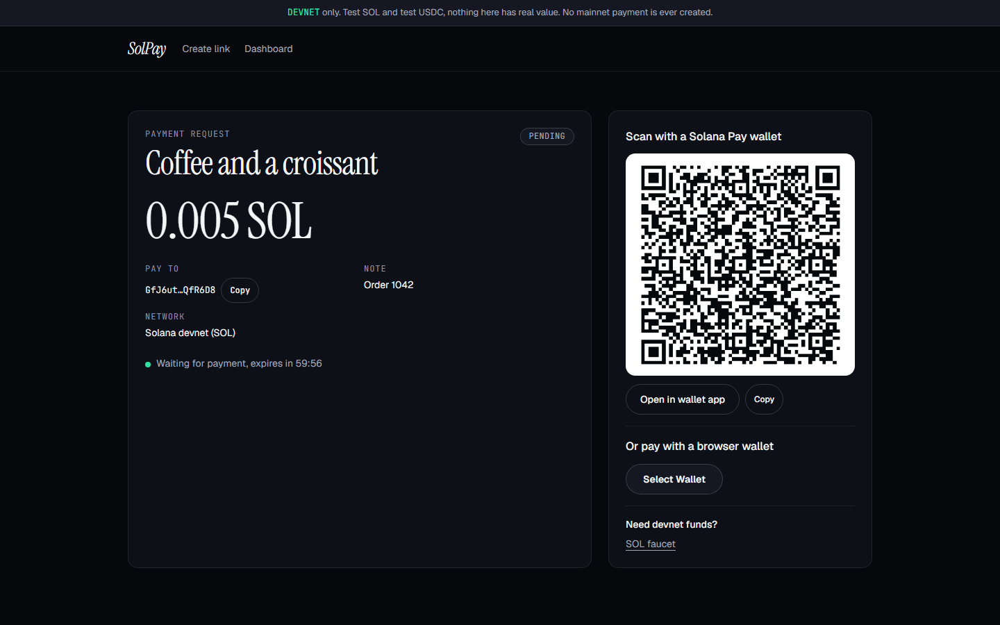
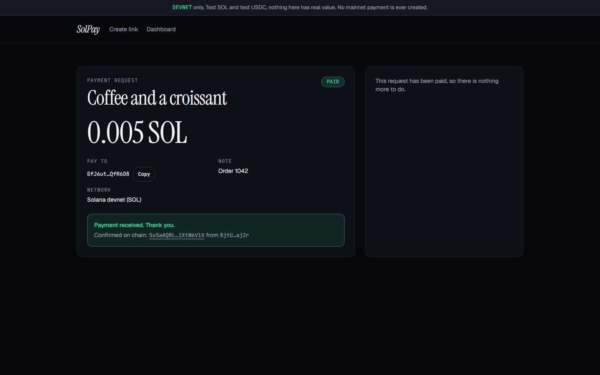
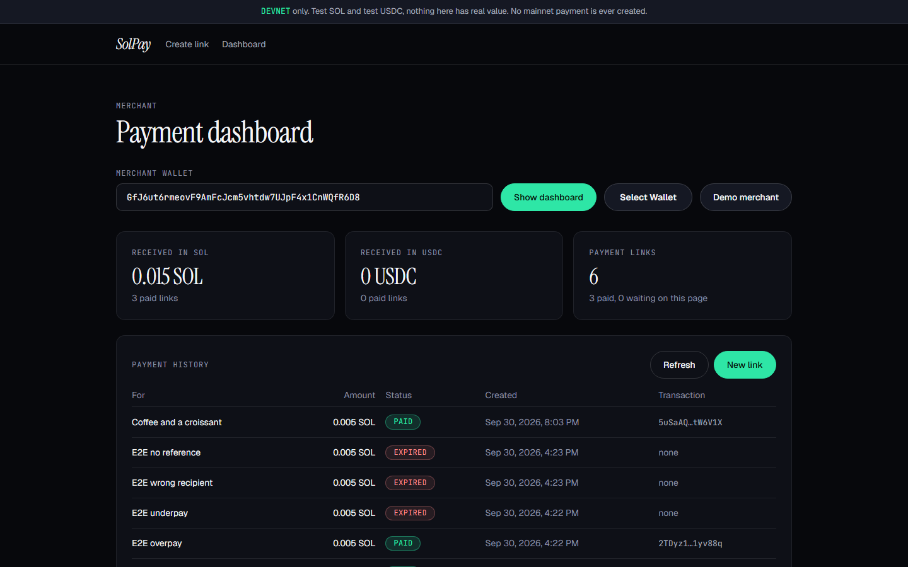

# SolPay Checkout: Solana Pay links with live confirmation

[](https://github.com/Waleed-Ilyas/solpay/actions/workflows/ci.yml)


Create a payment link for **SOL or USDC**, show the QR code, and watch it confirm on Solana devnet within seconds. A merchant dashboard lists every link with its status, totals and transaction.

**Live demo:** https://solpay-sable-five.vercel.app · **Personal project.** Devnet only: nothing here has value and no mainnet payment is ever created.







## Demo accounts

There are no accounts. The **Use the demo merchant** button fills in a devnet-only wallet, so you can create a link without a wallet of your own and pay it from any devnet wallet. The dashboard for that merchant already shows real payments made during testing.

## Program IDs and addresses (devnet)

SolPay deploys no program of its own. It reads and builds transfers with these:

| What                           | Address                                        |
| ------------------------------ | ---------------------------------------------- |
| System Program (SOL transfers) | `11111111111111111111111111111111`             |
| SPL Token (USDC transfers)     | `TokenkegQfeZyiNwAJbNbGKPFXCWuBvf9Ss623VQ5DA`  |
| Associated Token Account       | `ATokenGPvbdGVxr1b2hvZbsiqW5xWH25efTNsLJA8knL` |
| Circle devnet USDC mint        | `4zMMC9srt5Ri5X14GAgXhaHii3GnPAEERYPJgZJDncDU` |

Devnet SOL: [faucet.solana.com](https://faucet.solana.com). Devnet USDC: [faucet.circle.com](https://faucet.circle.com).

## Features

- **Payment links** for SOL and USDC with an exact amount, a label and an optional note. Links are valid for one hour.
- **Solana Pay QR code** built to the [transfer request spec](https://docs.solanapay.com/spec) (`solana:<recipient>?amount=&spl-token=&reference=&label=&message=&memo=`), plus an "Open in wallet app" deep link.
- **Pay from a browser wallet** (Phantom, Solflare, Backpack) with wallet-standard, or scan with a phone wallet.
- **Live confirmation.** The pay page polls the server every 3 seconds, and the server looks for the payment on chain. The page flips to **Paid** with a link to the transaction.
- **Merchant dashboard:** totals received in SOL and USDC, paginated payment history, status, transaction links, auto refresh while anything is pending.
- **Devnet helpers:** devnet banner, one-click SOL airdrop for the paying wallet, faucet links, explorer links on every address and transaction.
- **Clear states and errors:** loading, waiting with a countdown, paid, expired, not found, RPC trouble, wallet rejection and insufficient funds.

## Tech stack

Next.js 15 (App Router), TypeScript strict, Tailwind CSS v4, `@solana/web3.js`, `@solana/spl-token`, `@solana/wallet-adapter`, Neon Postgres (serverless driver), Zod, `qrcode`, Vitest, GitHub Actions.

## Architecture

```mermaid
flowchart LR
  M[Merchant] -->|create link| API[Next.js API<br/>validate, store]
  API --> DB[(Neon Postgres<br/>solpay_links)]
  P[Customer] -->|scan QR or pay in browser| W[Wallet]
  W -->|transfer + reference key| SOL[(Solana devnet)]
  Page[Pay page] -->|poll every 3 s| API
  API -->|getSignaturesForAddress(reference)<br/>getParsedTransaction| SOL
  API -->|mark paid once| DB
  Dash[Dashboard] --> API
```

**How a payment is matched.** Every link gets a fresh random public key, its _reference_. The payer's transfer includes it as a read-only account. Afterwards the server lists the transactions that mention that key and checks what happened to balances.

## How a payment is verified

A link becomes paid only when a transaction the RPC reports as **confirmed** meets all of these:

1. it **succeeded** on chain,
2. it **contains the link's reference key**, which ties it to that link and no other,
3. the merchant's balance of the right asset (SOL, or the USDC mint) **rose by at least the requested amount**.

Paying more than asked is accepted, paying less is not. The browser is never trusted: it can only ask the server to check. The check works from balance changes rather than instruction names, so plain transfers, `transferChecked`, and wallets that add extra instructions are judged the same way.

## Getting started

```bash
git clone https://github.com/Waleed-Ilyas/solpay.git && cd solpay
pnpm install
cp .env.example .env     # add DATABASE_URL (free Neon), everything else is optional
pnpm migrate             # creates the solpay_links table
pnpm dev                 # http://localhost:3000
```

Without `DATABASE_URL` the app still runs for local development, keeping links in memory.

## Tests

```bash
pnpm test               # 47 unit tests
pnpm lint && pnpm typecheck
```

- **Unit tests (47):** exact amount parsing and limits (no floating point), the Solana Pay URL round trip, the payment verifier against realistic transaction fixtures (exact, over, under, wrong recipient, no reference, failed transaction, missing metadata, SOL and USDC), the service rules (expiry without a background job, one chain lookup per window, first signature kept, late payments still recorded, per-wallet rate limit, dashboard totals), and the wallet transaction builder.
- **Live devnet run (not part of CI):** `scripts/devnet-e2e.ts` plays a customer's wallet on real devnet. It reads the `solana:` URL with its own parser, pays from a funded keypair, and checks the running app. Verified on devnet: an exact SOL payment is detected with the right signature and payer, an overpayment is accepted, and an underpayment, a payment to the wrong recipient that carries the reference, and the right payment without the reference are all refused. The token path was verified the same way with a test SPL token standing in for USDC (`NEXT_PUBLIC_USDC_MINT`), including an underpayment that stayed pending.
- **Browser run (not part of CI):** Playwright drives the pages while an external wallet pays, and confirms the pay page flips to Paid by itself, and that the dashboard, validation, not-found page and mobile layout behave.

## Key engineering decisions

- **Implemented the Solana Pay transfer request directly** on `@solana/web3.js` and `@solana/spl-token` instead of a helper package. The spec is short, and owning the verification code matters when it decides whether money arrived.
- **Verify by balance change, not by parsing instructions.** It is independent of how a wallet builds the transaction and it covers SPL and Token-2022 transfers alike.
- **One unique reference per link** makes a payment unambiguous even when two links ask for the same amount to the same merchant.
- **Amounts are `bigint` base units end to end,** parsed from strings, so there is no floating point anywhere near money.
- **Exactly-once state change.** Marking a link paid is a single `UPDATE ... WHERE status = 'pending'`, so two requests noticing the same payment cannot double count.
- **Expiry is computed, not scheduled.** A pending link past its deadline is reported as expired when read. A payment that lands just after expiry is still recorded.
- **Serverless friendly.** Neon's HTTP driver needs no connection pool, and status checks are rate limited and cached per link so polling stays cheap on the RPC.
- **The store is an interface** with a Postgres and an in-memory implementation, so the service logic is tested without a database.

## Known limitations

- **Browser wallet path is untested with a real extension.** The transaction that a browser wallet signs is built by tested code and mirrors what the live script does, but I could not drive Phantom or Solflare from an automated browser here. The QR and external-wallet path is what the live runs exercised.
- **USDC was tested with a stand-in token,** not Circle's devnet USDC, because the test wallet held no USDC and the Circle faucet needs a captcha. The mint is configurable, and the verifier compares whichever mint is configured.
- **Dashboards are public by address.** Anyone who knows a merchant address can list its links. The same payments are already public on a block explorer, and links carry no secrets, but a real product would add wallet-signature sign-in.
- **Rate limits are per server instance,** as they use memory.
- **Confirmation uses the `confirmed` commitment,** which is fast but not `finalized`.

## What I'd improve next

- Sign in with a wallet signature so merchants see only their own dashboard, and let them cancel or duplicate a link.
- Solana Pay **transaction requests** (server-built transactions) with a memo and a receipt.
- Webhooks to the merchant when a link is paid, and CSV export of payment history.
- A finalized-commitment refund window and automatic refunds for double payments.
- Playwright tests in CI against a local validator so the whole flow runs without devnet.

## Author

Waleed Ilyas, Full Stack Engineer (MERN, Next.js, Solana).
[GitHub](https://github.com/Waleed-Ilyas) · [LinkedIn](https://www.linkedin.com/in/waleed-ilyas-664839213) · waleedilyas99@gmail.com

Released under the [MIT License](LICENSE).
